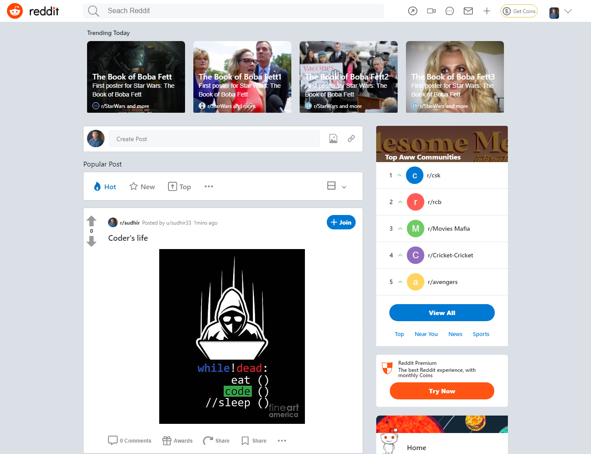
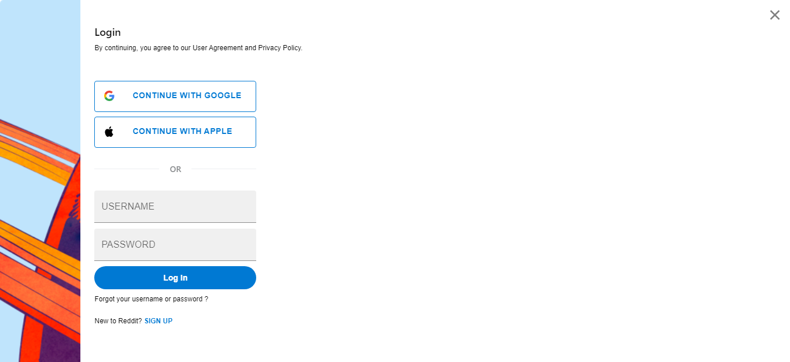
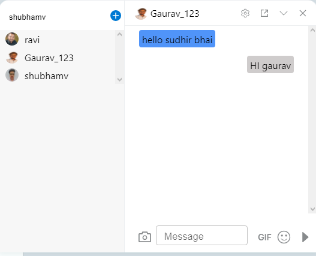
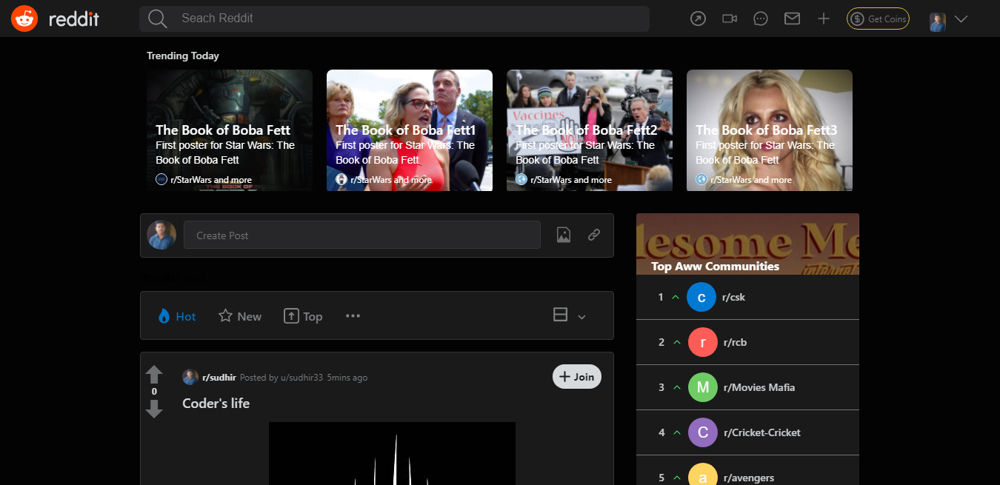
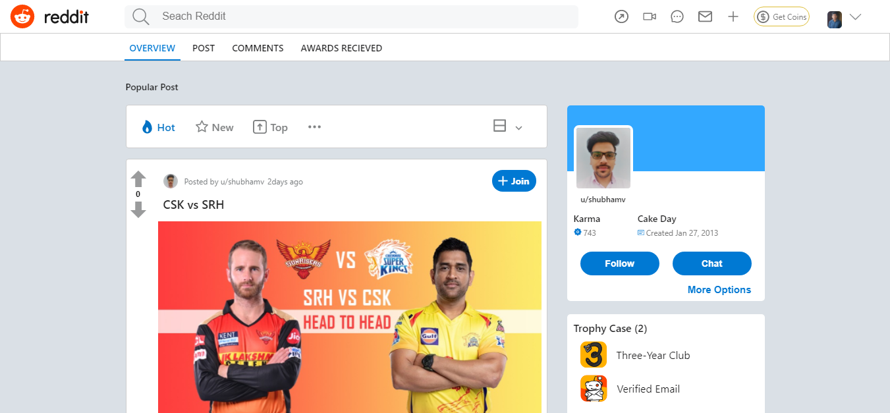

# Project Reddit.com - clone


**Reddit is an American social media platform. It is the home to thousands of communities, endless conversation, and authentic human connection.**

### We were given task to clone Reddit.com and we have build this site within 5 days with most of it's main functions like;- login & signup, creating a post, realtime chat, update profile picture, comments like & dislike etc.

## To Visit Backend Repo- [Click Here](https://github.com/vshubhams/reddit-backend)

### Landing Page :
The landing page of this website displays recent posts by users in different communities.

<br/>

<br/>

### Login Page:

Existing user can Login and new user's can SignUp themselves on page.
From NavigationBar of Landing Page.


After Login user direcly redirect to home page.

There are some Key Features which are added in website clone such as:

### Special features:

- _Chat Application_
- _Dark & Light Theme_

<p>



</p>

## Team Members and Contributors

- [@Ravi Shukla](https://github.com/ravishukla86044/)
- [@Shubham](https://github.com/vshubhams)
- [@Gaurav Parmar](https://github.com/Gaurav6291)
- [@Sudhir Kumar Samantaray](https://github.com/devSudhir)

## Library used
- ### styled-components [](https://github.com/styled-components/styled-components)

- ### react-icons [](https://www.npmjs.com/package/react-icons)

- ### socket.io-client [](https://www.npmjs.com/package/socket.io-client)

## Technologies Used

<p float="left">
  
   
  
  
  
  
  
</p>

## Installing and Running

Executing the commands mentioned below one by one in your command line will help in making this React app .
**Cloning**

```
git clone https://github.com/ravishukla86044/reddit

```
**To run the react app execute below command**

```
cd ./reddit
npm install
npm run start

```
